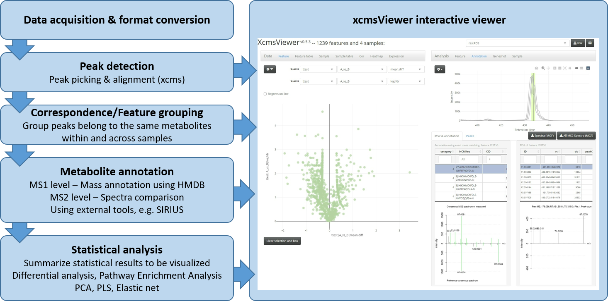
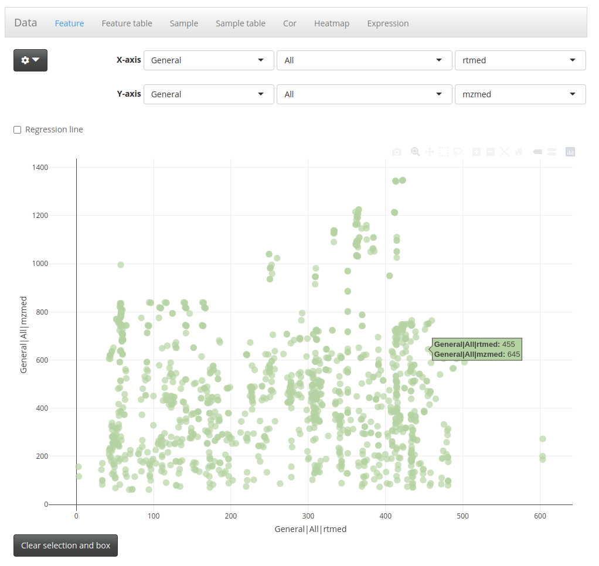
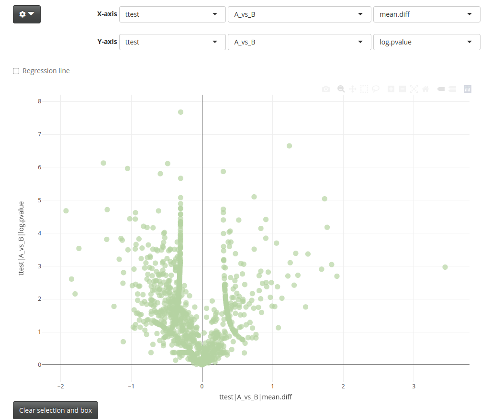
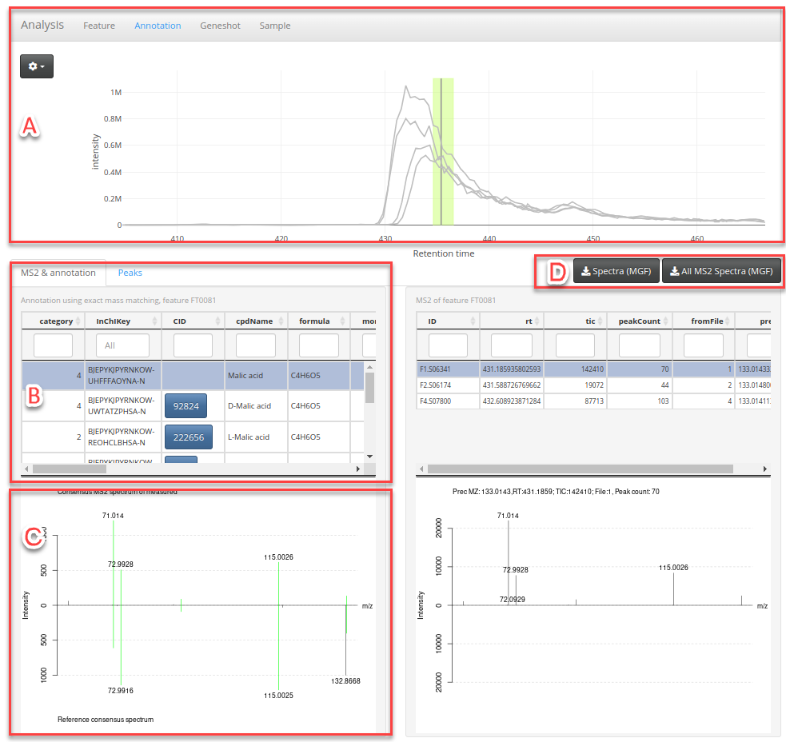

```{r setup, include=FALSE}
knitr::opts_chunk$set(echo = TRUE)
# knitr::opts_chunk$set(echo = TRUE, fig.align="center")
```

## The xcmsViewer pipeline

The xcmsViewer package provides a pipeline for analyzing and visualizing the
mass spectrometry-based untargeted metabolomics data. It emphasizes the following features:

* __A comprehensive pipeline from data preprocessing to statistical analysis__ 
The pipeline (as shown in Figure 1) includes data pre-processing using R/Bioconductor package [xcms](https://www.bioconductor.org/packages/release/bioc/html/xcms.html) 
(i.e. peak picking, retention time alignment, feature identification and quantification. 
[here](https://www.bioconductor.org/packages/release/bioc/vignettes/xcms/inst/doc/xcms.html#5_Alignment) 
is a tutorial.), feature annotation using public or in-house annotation database,
statistical analysis using R and results visualization using [R/Shiny](https://shiny.rstudio.com/).

<center>
{width=75%}
</center>


* __Integrated annotation database for metabolites identification__ The feature annotation 
(or identification of metabolite) is performed on both MS1 and MS2 levels. On the MS1 level, 
the mass of metabolites (by adding or removing certain adducts) are compared with the 
mass of known metabolites to annotate features. On the MS2 level, the MS2 spectra are 
compared with the spectra of known metabolites in annotation database. The annotation
database provided along with _xcmsViewer_ are compiled from [HMDB](https://hmdb.ca/) (experimental spectra) 
and [MSDIAL](http://prime.psc.riken.jp/compms/msdial/main.html#MSP) (all public MS/MS). 
Additionally, users can also create in-house database
to annotate metabolites. 

* __Expression matrix-centric__ The feature table returned by [xcms](https://www.bioconductor.org/packages/release/bioc/html/xcms.html) 
is a matrix, where rows are features/metabolites, columns are samples, and the values 
in the matrix are the intensities of features/metabolites in each sample. 
Such a matrix is usually a starting point for the downstream statistical analysis, 
such as differential expression, feature selection, etc. 
Due to the immaturity of metabolomics data processing, we often need to check 
the chromatograms behind intensity and how well an MS2 spectrum matched a 
reference spectrum. In xcmsViewer, the "expression matrix" plays a 
central role in bridging the evidence of metabolite identification
(e.g., chromatogram, spectra comparison) with statistical results 
(e.g., different expression).

* __Suitable for large sample sizes__ Instead of loading all files into memory, 
xcmsViewer processes raw files sequentially. In most of the steps, only one raw file 
is loaded into memory at a time for peak picking, so a large number of raw files 
could be handled with a less powerful computer. 

* __Flexibility in statistical analysis and a separated viewer for statistical 
results visualization__ The xcmsViewer is seamlessly integrated into the R environment, 
therefore, it inherits the flexibility of statistical analysis given by R. Importantly,
once the statistical analyses have been incorporated into the results, other users will 
be able to check it directly, with any need of coding. 

* __Interactive visualization__ XcmsViewer visualizes features and samples in two-dimensional 
spaces defined by any statistical analyses used for prioritizing interesting candidates. 
Users can interactively select a subset of samples or features of interest. Downstream analyses 
(e.g., enrichment analysis, correlation analysis) are performed spontaneously in response to the 
selected features or samples. The interactive visualization enables fast hypothesis 
evaluation and generation. 

* __Deliverable__ The processed data, together with the visualization using the 
Shiny app, could be delivered to the collaborator as standalone software or using 
shiny-server. Your collaborator will not need to install any program to explore the results.

## Installation

The xcmsViewer is still under active development and available from github:

```{r install, eval=FALSE}
devtools::install_github("mengchen18/xcmsViewer")
```

In addition, the xcmsViewer package is largely dependent on the [omicsViewer]
package. If you want to access the most recent version of _omicsViewer_, please
install the github version of _omicsViewer_ first:
```{r install_omicsViewer, eval=FALSE}
devtools::install_github("mengchen18/omicsViewer")
```

## Example dataset and analysis

In this vignette, we work with a simple experiment of 4 measurements (using data dependent 
acquisition). The files can 
be downloaded from [Zenodo](https://zenodo.org/record/6576232). As indicated by the 
file names, there are two experimental conditions A and B, each condition has 
two replicates. This experiment aims to find the metabolites of
differential abundance between the two conditions. To achieve this goal, we will 
process the data to find which metabolites could be detected and how abundant they are
in each sample. Next, we will use t-test to compare samples from the two conditions to find metabolites
significantly different in their abundance. In the data exploration, we can visualize 
the t-test results using a [volcano plot](https://en.wikipedia.org/wiki/Volcano_plot_(statistics))
to prioritize the interesting metabolites. 

## Start the viewer

In a highly collaborative research environment, the computational scientist will perform the data processing and statistical analysis, and the wet-lab scientist will mainly focus on biological interpretation. One of the primary purposes of xcmsViewer is to facilitate data sharing and communication between researchers of different backgrounds. Therefore, xcmsViewer consists of a separate data processing pipeline and visualization pipeline. In the data processing, users should perform feature identification and annotation, including statistical analysis needed for the data interpretation, then store the data into an object to be visualized using the Shiny interface. The Shiny user can directly explore the statistical results and focus on data interpretation without worrying about data processing details. 

Therefore, before we look into how to prepare the object, we first see how we can open the Shiny interface and how to explore the results using it. The analysis mentioned in the previous section has been prepared and shipped together with xcmsViewer package. We can open it as below:

```{r start_viewer, eval=FALSE}
library(xcmsViewer)
xcmsViewer( system.file("extdata", package = "xcmsViewer") )
```

Users must first load data using the dropdown box in the top-right corner. This 
interface is build based on the [omicsViewer](https://bioconductor.org/packages/release/bioc/html/omicsViewer.html) 
package. You can find a tutorial for the interface [here](https://bioconductor.org/packages/release/bioc/vignettes/omicsViewer/inst/doc/quickStart.html).
There is only one object in this example. Usually, we have at least two datasets in actual
experiments, one for the negative mode and one for the positive mode. 

### The left panel

After loading the data, we see a few tabs on the left-panel, we will mainly check
a few unique features at _xcmsViewer_ (as compared to _omicsViewer_):

* __Feature__ In this tab, every point is a feature, which are usually shown in 
a two-dimensional space. Some of the features could be annotated
with known metabolites. By default,
the x-axis is retention time and the y-axis is the mass-to-charge ratio (Figure 2).

<center>
{width=75%}
</center>

We can also visualize features in other two-dimensional spaces defined by 
any statistical results. For example, in this experiment, we used a t-test to compare
groups A and B. We can use a volcano plot to visualize the results of differential 
expression. To show features in a volcano plot, users need to change the x- and y-axis
by selecting the dropdown box of "x-axis" and "y-axis" on top, that is, the x-axis should 
be set to mean difference (mean.diff), and the y-axis is should be log transformed p-values (log.pvalue). 
Of note, the mean difference is on the log10 scale, which means 1 (or -1) on the x-axis
indicate a 10-fold difference in the original scale. 

Users can use the box or lasso selection function to select features from the figures. 
The selected feature will be shown in the __Feature table__ and sent to the right
panel for downstream analysis. 

<center>
{width=75%}
</center>

When a single feature is selected from this tab or _Feature table_ tab, usually it 
is helpful to check the chromatogram and the match of MS2 spectra (if available). This
could be done by checking the _Annotation_ tab on the right panel (see below for more information).

* __Feature table__ Every row is a feature. The feature table shows information about the features, like mass, retention time, and possible annotated metabolites. The _annotate_MS2_ column is a categorical variable to indicate how well the annotations are. It could be one of _NI, 0, 1, 2, 3, 4_. 
  - _NI_ means the identified feature mass is not mapped to any metabolites in the annotation database. 
  - _1_ means only the feature mass is matched with the metabolite candidate in the database, and no MS2 information is used. 
  - _0_ means the MS2 spectra matching suggests the annotation is likely incorrect.
  - _2_ means partial match of MS2 spectra (at least one peak match).
  - _3_ means feature mass and retention time are matched, but no MS2 spectra match. In the default annotation database, no retention time information is available. Therefore, this category only exists when users provide the information or integrate the in-house annotation database. 
  - _4_ means high similarity between measured MS2 spectra and database MS2 spectra. 
* __Sample__ Every point is a sample. It is a fully interactive figure like the __feature__ panel. Users can select a subset of samples, which will be updated in the _Sample table_ tab as well. 
* __Sample table__ The table shows the meta information of samples. Extra columns could be manually added to the table using the dropdown box on top. 
* __Cor__ The heatmap shows the correlation matrix of samples.
* __Heatmap__ The heatmap shows the intensity matrix, where rows are features and columns are samples. Users can drag a box to select a subset of rows and columns, double click on the selection box will zoom in or zoom out. The gear button (top left corner) on this panel provides functions to resort rows and columns according to variables in the _Sample table_ and the _Feature table_. Additionally, color bars could be added there to help interpret the heatmap. 
* __Expression__ A table to show the intensity matrix. 

### The right panel

The right panel reacts on the features and samples selected from the left panel. 
The _Annotation_ tab (Figure 4) is specific for checking the metabolomics data. 
Users can use it to check chromatogram quality and MS2 peak matches. 
In figure 4, panel A shows the chromatogram. Panel B is a table where every
row is a metabolite from the annotation database whose mass is mapped to the 
feature under checking. Some of these annotations will also have MS2 peaks matched
to MS2 peaks detected in the experiment (Panel C). In addition, we may see 
some features with good MS2 peaks, but the peaks are not mapped to any know 
metabolites in the annotation database. In these cases, we can download the MS2
spectra in MGF format and use it to infer the compound structure, for example, 
using [SIRIUS](https://bio.informatik.uni-jena.de/software/sirius/). 

<center>
{width=75%}
</center>


## Data processing using xcmsViewer

Now we will learn how to use xcmsViewer to prepare the object that has been explored in the previous section. 

### Prepare project folder
In this tutorial, we will work in a project folder in this structure:

```
 --- projectA:
  |--- R - save all rscripts
  |--- mzXML - store the mzXML files
  |--- Rds - store intermediate or temporary objects created during processing
  |--- xcmsViewerData - save the final object to be visualzed using xcmsViewer 
```
 
If you have not do so, please download the example from [Zenodo](https://zenodo.org/record/6576232)
and put the four files intot he mzXML folder. Then we are ready to move to the next section.


### Loading packages and annotation data

```{r load_annotaiton_database, eval=FALSE}
# setwd("projectA") # change to the working directory
# loading required libraries
library(parallel)
library(BiocParallel)
library(omicsViewer)
library(xcms)
library(xcmsViewer)

# loading annotation data
data("hmdb_msdial")
```

_hmdb_msdial_ is the feature annotation database compiled from HMDB experimental spectra and the MS-DIAL public dataset. 

* __InChIKey__ InChIKey of metabolite. Values in this column are unique. 
* __CID__ Pubchem compound ID.
* __cpdName__ Compound name.
* __formula__ Compound formula.
* __monoMass__ Monoisotopic mass of metabolite.
* __POS_mass__ Peak mass of consensus MS/MS spectra in positive ionization mode. Multiple semi-colons separate values. 
* __POS_intensity__ Peak intensity of consensus MS/MS spectra in positive ionization mode. Semi-colons separate multiple values. 
* __POS_purity__ Purity of consensus MS/MS spectra in positive ionization mode. It should be a value between 0-1. One means the individual MS/MS spectrum has a good agreement. Multiple MS2 spectra from different resources are combined into consensus MS2 spectra. In this process, consensus spectra only include peaks presented in more than 2/3 of all spectra. The purity value indicates how many spectra do not contain any spectra included in the consensus spectra.
* __POS_sourceId__ The IDs of combined MS/MS spectra are combined to get the consensus MS/MS spectra in positive mode.
* __NEG_mass__ See POS_mass, for negative ionization mode.
* __NEG_intensity__ See POS_intensity, for negative ionization mode.
* __NEG_purity__ See POS_purity, for negative ionization mode.
* __NEG_sourceId__ See POS_sourceId, for negative ionization mode.
* __smiles__ SMILES of metabolite.
* __RT__ Retention time. For the public database, this column is set to NA. Users can add in-house annotations and give RT, so the RT will also be considered in metabolite annotation.

### In-house annotation data
Users can prepare an in-house annotation data following the format above and merge it with the public
database. 

### Prepare phenotypical/meta data

This dataset contains 4 samples, two from condition A and two from condition B, each condition has two replicates. 
We create a data.frame to show the experimental design.
```{r phenotype, eval=FALSE}
# prepare meta data
ff <- list.files("mzXML")
pd <- data.frame(file = file.path("mzXML", ff), stringsAsFactors = FALSE)
pd$label <- sub(".mzXML", "", basename(pd$file))
pd$group <- c("A", "A", "B", "B")
```

The experimental design _data.frame_ should contain at least two columns named "file" and "label". The "file" column tells which mzXML (or mzML) files will be processed and where these files are. The "label" column contains the unique label for every sample. In this tutorial, we are working on a straightforward experimental design, therefore, only one factor "group" is added to tell which sample is from which biological group. However, users should try to include all meta information helpful for data interpreting in more complex experimental designs. Doing so will make the best use of xcmsViewer, where users can quickly link any meta information to the metabolites and explore many assumptions quickly. 

### Get feature intensity matrix
The next step is to process data to get an intensity matrix, where rows are features and columns are samples. The matrix values correlate with the features' abundance in each sample. The processing consists of three steps, i.e., peak identification, alignment, and correspondence, defined in the R/Bioconductor package [xcms](https://www.bioconductor.org/packages/release/bioc/html/xcms.html). To know more information about the workflow, please refer to [here](https://www.bioconductor.org/packages/release/bioc/vignettes/xcms/inst/doc/xcms-lcms-ms.html). 

```{r preprocessing, eval=FALSE}
# feature identification and quantification
res <- runPrunedXcmsSet(
  files = pd$file, # path to the files
  pheno = pd, # phenotype data
  tmpdir = "Rds/temp", # folder to store temporary files, needs to be an emppty folder or not existing then a new folder will be created
  postfilterParam = list(
    postfilter = c(5, 3000), # at least 5 peaks has intensity higher than 3000
    ms1.noise = 100, # ms1 spectrum, intensity lower than this will be considered as noise
    ms1.maxPeaks = Inf,  # ms1 spectrum, maximum number of peaks to retain
    ms1.maxIdenticalInt = 20, # noise peaks are usually same intensity, maximum number identical peaks to be considered as non-noise
    ms2.noise = 30, # same but for ms2
    ms2.maxPeaks = 100, 
    ms2.maxIdenticalInt = 6,
    BPPARAM=bpparam() # parallel processing
    ),
  keepMS1 = FALSE, # should the MS1 be kept, if yes, we can generate chromatogram give an intensity range. But it will make the data much larger. 
  mode = "neg", # ionization mode, "pos" or "neg"
  ref = hmdb_msdial, # feature annotation database
  RTAdjustParam = PeakGroupsParam(minFraction = 0.5, span = 0.5), #  retention time adjustment parameter, will be passed to "adjustRtimePeakGroups"
  ppmtol = 20, # mass tolerance in PPM
  mclapplyParam = list(fun_parallel = mclapply, mc.cores = 4) # parallel
)

saveRDS(res, file = "Rds/xcmsViewer_intermediate_obj.RDS") # save the data
```


### Statistical analysis

#### Convenient function

The last step in the workflow is to perform statistical analysis on the data. 
XcmsViewer implemented a convenient function to perform most frequently used 
analyses, such as t-test or PCA. The _prepViewerData_ function will create an
object can be visualized using shiny app. User should always use call this function
first, then we can add results of other analyses to the object later. 

```{r statistical_analysis, eval=FALSE}
# statistical analysis
expr <- log10( exprs(res@featureSet) ) # usually we log10 transform the original expression matrix. 
boxplot(expr)
exprs(res@featureSet) <- normalize.nQuantiles(expr, probs = 0.5) # median centering of columns of expression matrix

tcs <- rbind(c("group", "A", "B")) # define a matrix tells which groups should be compared
viewerObj <- prepViewerData( object = res, median.center = FALSE, compare.t.test = tcs,  fillNA = TRUE, paired = FALSE)
saveRDS(viewerObj, "xcmsViewerData/res.RDS")

# start viewer
xcmsViewer("xcmsViewerData/") # start the viewer
```

#### Customized analysis

One of the advantages of xcmsViewer is that any statistical result could be incorporated into the results and, therefore, be used to visualize the data in the Shiny interface and prioritize the interesting candidates. 

Imaging another experiment has more samples studied, and assuming we have a quantitative phenotypical variable, we want to know which metabolites are well correlated with it. To extract this information, we can perform a correlation analysis. Because we usually visualize features in a 2-Dimensional space, we can calculate the correlation coefficient R and (logarithm transformed) p-value, then combine them with the previously created object. In the Shiny interface, we will use the R and (logarithm transformed) p-value to visualize features. It does not make sense to perform such an analysis with data of samples, but this trivial 
the example is good enough to exemplify the idea. 

```{r statistical_customized, eval=FALSE}
# define a variable which should be tested with 
var1 <- c(1, 1.5, 5, 6) 
expr <- exprs(viewerObj@featureSet)
cors <- apply(expr, 1, function(x) {
  if (sum(!is.na(x)) < 3) # if less than 3 valid values, then return NA
    return(c(NA, NA))
  r <- cor.test(x,  var1, use = "pair")
  c(r$p.value, r$estimate)
})
corstats <- data.frame(
  R = cors[2, ],
  p.value = cors[1, ]
)
# log transform for visualization
corstats$log.pvalue <- - log10(corstats$p.value)

# to add prefix to the column headers
colnames(corstats) <- paste("cor_test", "var1", colnames(corstats), sep = "|")

# add the correlation test results to the object
fd <- fData(viewerObj@featureSet)
fd <- cbind(fd, corstats)
fData(viewerObj@featureSet) <- fd

# save results
saveRDS(viewerObj, file = "xcmsViewerData/res_with_cortest.RDS") # save the data
```

Then in the Shiny app, the features can be visualized in a two-dimensional space where
the x-axis is "R" and the y-axis is "log.pvalue". 

## Session Information

R session used to generate the vignette:

```{r pressure, echo=FALSE}
sessionInfo()
```


